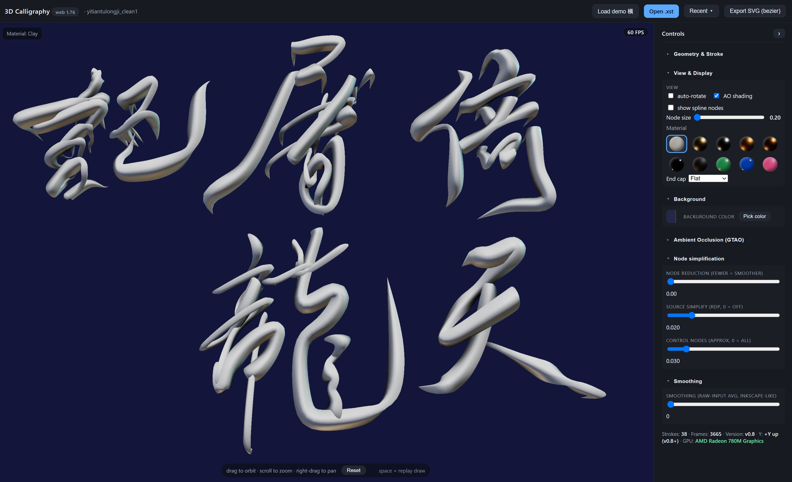

# 3D Calligraphy — Expresii `.xst` Viewer

An interactive 3D viewer for **Expresii** brush-stroke files (`.xst`). It parses the
stroke/expansion data, builds variable-width 3D brush geometry, and lets you orbit,
zoom, replay the draw-in, and recolor strokes with realistic PBR materials — all in the
browser, no build step.



---

## Open the viewer

There are two ways to run it:

### 1. Offline (no internet, no server) — recommended
Just **double-click `3d-calligraphy-offline.html`**. Three.js is vendored locally in
`3d-vendor/`, so it works fully offline. Keep the `3d-vendor/` folder next to the HTML
file (don't move the HTML without it).

### 2. Online (served)
Serve the folder and open the online build, which loads Three.js from a CDN:

```bash
# from this folder
python -m http.server 8123
# then open http://localhost:8123/3d-calligraphy.html
```

---

## Controls

| Action | How |
|--------|-----|
| Orbit | drag (left mouse) |
| Zoom | scroll wheel |
| Pan | right-drag |
| Replay draw-in | press **Space** |
| Skip replay → show finished piece | press **Esc** during a replay |
| View reset | **Reset** button — eases the camera back to the initial front-view angle and zooms to fit |
| Open a file | **Open** button or drag-and-drop an `.xst` file |

The bottom hint bar shows the mouse controls on the left and `space = replay draw` on the
right; **Reset** sits between them as part of the view interaction.

---

## Materials

The **Material** row shows a grid of real material-ball previews (rendered mini-spheres).
Click a ball to apply that material to the whole artwork. The selected ball is marked with
a blue frame. Available materials:

`Clay` · `Gold` · `Silver` · `Bronze` · `Copper` · `Chrome` · `Real ink` ·
`Jade` · `Sapphire` · `Pink`

Defaults: background **RGB(37, 39, 70)**, material **Clay**.

---

## Titles

If the `.xst` file contains a `'` (title) command it is shown; otherwise the viewer falls
back to the **file name** (extension stripped).

---

## Preferences

- **Background color** — color picker + preset swatches.
- **Ambient occlusion** — toggle for contact shadows (GTAO via post-processing).
- **Stroke width / depth / thickness** — geometry shaping controls.

Settings are remembered per file in `localStorage`.

---

## Repository layout

```
3d-calligraphy.html          Online build (Three.js r160 from CDN)
3d-calligraphy-offline.html  Offline build (self-contained, vendored Three.js)
3d-vendor/                   Three.js r160 core + addons (MIT, see THREE-LICENSE.txt)
verify-xst.js                Parser test suite (37 checks)
```

---

## Credits & License

- **3D Calligraphy viewer** — code in this repository.
- **Three.js** (r160) is used under the **MIT License**. The vendored copy in `3d-vendor/`
  retains its `@license` headers, and the full license text is in
  `3d-vendor/THREE-LICENSE.txt`.

See `THREE-LICENSE.txt` for the complete MIT license of Three.js.
